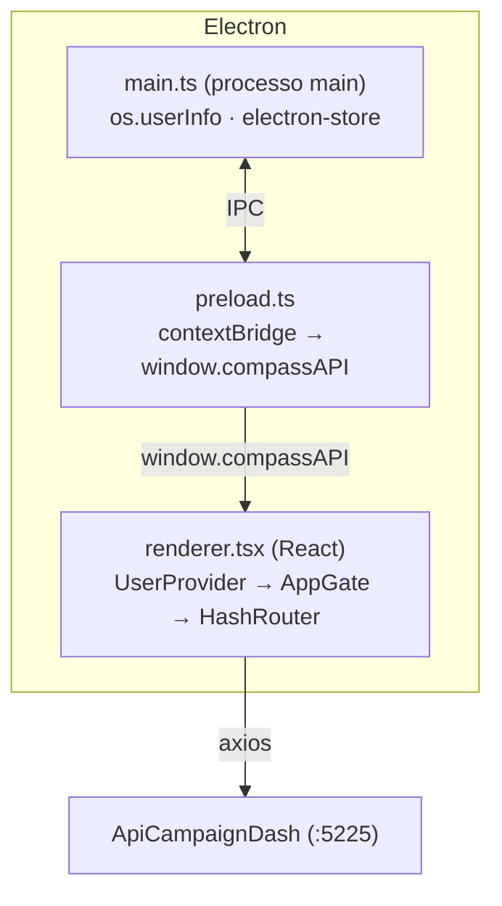

# Compass

Aplicativo desktop (Electron + React + TypeScript) que centraliza o acompanhamento de campanhas comerciais e de televendas da Solfarma - metas, realizado, premiação, sell-out por canal (Televendas/Bees) e relatórios dinâmicos. Consome a API **[ApiCampaignDash](https://github.com/RudineiCTS/ApiCampaignDash)** como backend.

> No `package.json` o pacote ainda se chama `meu-app` (nome herdado do template do Electron Forge) - o produto é tratado como **Compass** em todo o app (telas de login, onboarding etc.).

## Sumário

- [Visão geral](#visão-geral)
- [Telas e funcionalidades](#telas-e-funcionalidades)
- [Arquitetura](#arquitetura)
- [Stack](#stack)
- [Estrutura do repositório](#estrutura-do-repositório)
- [Como rodar localmente](#como-rodar-localmente)
- [Configuração](#configuração)
- [Status / limitações conhecidas](#status--limitações-conhecidas)

## Visão geral

O Compass é a "ponta" visual do ecossistema de campanhas: cadastra nada, só lê e apresenta o que a API já apurou. Ele roda como app desktop (Windows, via Electron) e identifica quem está usando a máquina a partir do usuário logado no Windows, sem tela de login tradicional - a API decide se aquele usuário tem acesso ao sistema.

## Telas e funcionalidades

| Rota | Tela | O que faz |
|---|---|---|
| `/` | Tela inicial | Boas-vindas com o nome do usuário logado |
| `/campaigns` | Campanhas Rodando | Campanhas ativas no mês, com meta, realizado, % atingido e premiação |
| `/campaigns/details/:id` | Detalhe da campanha | Configuração completa (escopo, cálculo, faixas de premiação, regras), ranking de vendedores/supervisores e geração de script SQL de conferência |
| `/campaigns-advanced` | Painel avançado | Duas abas: **Comparativo de Vendas** (evolução mês a mês) e **Relatório Dinâmico** (o usuário monta a consulta escolhendo dimensões, métricas e filtros) |
| `/campaigns-history` | Histórico de campanhas | Campanhas já apuradas em meses anteriores, com exportação |
| `/campaign-received` | Campanhas Recebidas | Campanhas cadastradas recentemente, por mês |

Antes de chegar em qualquer uma dessas telas, o app passa por um fluxo de acesso (ver [Arquitetura](#arquitetura)):

1. Verifica o usuário do Windows logado (`os.userInfo().username`) e busca o perfil dele na API (`GET /api/system-user/{userName}`).
2. Se o usuário não existir no sistema ou estiver inativo, mostra uma tela de bloqueio (com opção de tentar de novo).
3. Se for o primeiro login desse Compass nessa máquina, mostra um carrossel de boas-vindas (3 passos) antes de liberar o app.

## Arquitetura



- **`main.ts`** roda no processo Node/Electron: lê o usuário do Windows (`node:os`) e guarda localmente (via `electron-store`) se aquele usuário já viu a tela de boas-vindas, expondo os dois por IPC (`ipcMain.handle`).
- **`preload.ts`** expõe só o necessário pro renderer através de `contextBridge` (`window.compassAPI`), mantendo `contextIsolation` ativo - o renderer nunca tem acesso direto ao Node.
- **`UserContext`** (React) consome essa bridge, busca o perfil na API e decide: carregando / bloqueado / onboarding / app normal. **`AppGate`** só renderiza a árvore de rotas depois que esse estado resolve.
- **`ThemeContext`** controla o tema claro/escuro (persistido em `localStorage`, independente do fluxo de usuário).
- Cada feature segue o mesmo padrão de 3 camadas no lado do dado: `interfaces/*.ts` (contrato), `services/*.ts` (chamada `axios` pra API) e `hook/use*.tsx` (estado + efeito), consumidos pelas páginas em `pages/`.

## Stack

- Electron 42 + Electron Forge (build/empacotamento) com o plugin Vite
- React 19 + TypeScript
- React Router (`HashRouter`, exigido pelo `file://` do Electron)
- Tailwind CSS
- axios (consumo da API), dayjs (datas)
- `electron-store` (persistência local leve - hoje só a flag de onboarding)
- `xlsx` (exportação de planilhas)

## Estrutura do repositório

```
dash-electron/
├── src/
│   ├── main.ts              # processo main do Electron (janela, IPC, electron-store)
│   ├── preload.ts            # contextBridge (window.compassAPI)
│   ├── renderer.tsx           # bootstrap do React + rotas
│   ├── electron.d.ts          # tipagem de window.compassAPI
│   ├── context/               # ThemeContext, UserContext
│   ├── components/            # componentes de UI, agrupados por área (GlobalComponents, ComponetesTelesales, shared...)
│   ├── pages/                 # uma página por rota
│   ├── hook/                  # hooks de dado (um por feature)
│   ├── services/              # chamadas axios pra API (uma por feature)
│   ├── interfaces/            # tipos compartilhados entre service/hook/página
│   └── utils/                 # formatação, exportação (csv/xlsx), datas
├── forge.config.ts             # config do Electron Forge (makers, plugin Vite, fuses)
├── vite.main.config.ts / vite.preload.config.ts / vite.renderer.config.ts
└── tailwind.config.js
```

## Como rodar localmente

Pré-requisitos: Node.js e a **[ApiCampaignDash](https://github.com/RudineiCTS/ApiCampaignDash)** rodando localmente (por padrão em `http://localhost:5225`).

```bash
git clone https://github.com/RudineiCTS/dash-electron.git
cd dash-electron
npm install
npm start
```

`npm start` sobe o Electron Forge em modo dev (hot reload via Vite). Sem a API no ar, as telas que dependem de dados (campanhas, relatórios, login) ficam em erro/carregando indefinidamente - o app não funciona sem o backend.

## Configuração

- **URL da API**: configurável via variável de ambiente `VITE_API_HOST` (só `host:porta`, sem protocolo). Copie [`.env.example`](.env.example) para `.env` (ignorado pelo git) e ajuste pro seu ambiente:
  ```
  VITE_API_HOST=192.168.30.22:5225
  ```
  Sem `.env`, cai no padrão `localhost:5225` (ver [`src/services/api.ts`](src/services/api.ts)). Como é lido em tempo de build pelo Vite, uma mudança no `.env` exige reiniciar o `npm start` (ou rebuildar, se for um pacote já empacotado).
- **CORS**: a API só libera as origens `http://localhost:5173` e `http://192.168.3.208:5173` (ver `Program.cs` do backend) - isso depende de onde o Compass é *servido* (o renderer), não do IP da API que ele consome, então normalmente não precisa mudar só por trocar o `VITE_API_HOST`. Mas atenção: isso vale pro app rodando em modo dev (`npm start`); o app **empacotado** (`npm run make`/`package`) carrega via `file://`, cuja origem pode não bater com essa lista - vale validar CORS antes de distribuir um build de produção apontando pra um servidor remoto.
- **Dados armazenados localmente**: o `electron-store` guarda só um flag booleano (`hasSeenWelcome`) em disco, na pasta de dados do usuário do Electron - nenhuma credencial ou dado de campanha fica em cache local.

## Status / limitações conhecidas

- Sem testes automatizados (nenhum framework de teste configurado ainda).
- Não há autenticação tradicional (senha/token) - o acesso depende inteiramente do usuário do Windows estar cadastrado e ativo na base de perfis do Compass; qualquer pessoa com acesso à máquina e a esse usuário do Windows entra no app.
- CORS do backend ainda não foi validado para o app empacotado (`file://`) apontando pra um servidor remoto - só para o modo dev (ver [Configuração](#configuração)).
- `package.json` mantém `name`/`productName` como `meu-app` (nunca renomeado para Compass).
